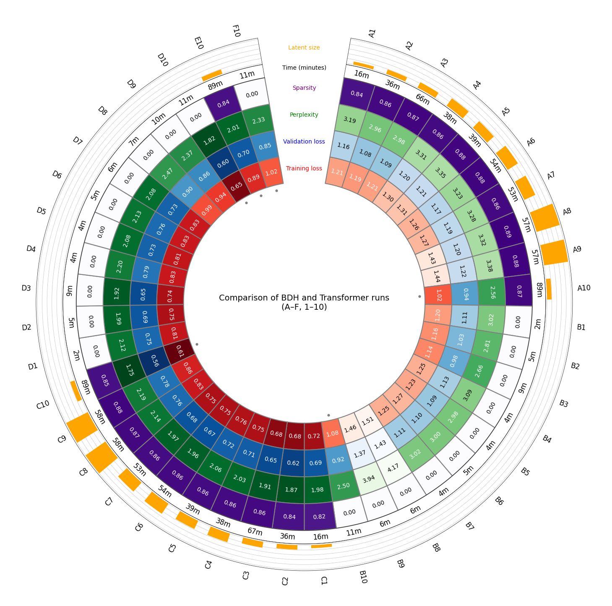

## Tuning & visualisation of Dragon Hatchling architecture 
Prerequisite: https://github.com/pathwaycom/bdh

# English-WIKI dataset
### 1.0 invariant model components
Training only
| Loss Function | Dropout |
|---------------|---------|
| cross-entropy | 0.1     |

Inference only
| Generation (Top-k) | Temperature |
|--------------------|-------------|
| 3           | 1.0         |

Training & inference
| Tokenization | Vocabulary | Attention | Positional Encoding | Activation | Sequence Length |
|--------------|------------|-----------|---------------------|------------|-----------------|
| Bits-per-byte   | 256        | causal    | RoPE                | ReLU       | 512             |

NOTE: Batch size is dynamically adjusted per run based on available GPU memory and effective utilization, rather than being fixed across experiments.

### 1.1 Initial sweep and follow-up sweep (informed by initial results)

# English-WIKI dataset
##### (BDH) Tunable hyperparameters

| Run | Layers | Emb | Heads | MLP Mult | LR | Batch | Weight Decay | Iterations | 
| --- | ------ | --- | ----- | -------- | -- | ----- | ------------ | ---------- |
| A1   | 6      | 256 | 4     | 64       | 1e-3 | 8    | 0.1          | 6k    |
| A2   | 8      | 384 | 6     | 64       | 5e-4 | 4    | 0.1          | 12k   |
| A3   | 12     | 512 | 8     | 64       | 3e-4 | 2    | 0.1          | 20k   |
| A4 | 8 | 384 | 6 | 128 | 5e-4 | 2 | 0.05 | 12k |
| A5 | 8 | 384 | 8 | 128 | 5e-4 | 2 | 0.05 | 12k |
| A6 | 8 | 512 | 8 | 128 | 4e-4 | 2 | 0.05 | 12k |
| A7 | 8 | 512 | 16 | 128 | 4e-4 | 2 | 0.05 | 12k |
| A8 | 8 | 512 | 8 | 256 | 4e-4 | 1 | 0.01 | 12k |
| A9 | 8 | 512 | 8 | 256 | 4e-4 | 1 | 0.1 | 12k |
| A10 | 8 | 384 | 6 | 64 | 5e-04 | 4 | 0.1 | 30k |

##### (BDH) Evaluation metrics (model output)
| Run | Train Loss | Val Loss | Perplexity | Sparsity | Latent/Layer | Time (hrs) |
| --- | ---------- | -------- | ---------- | -------- | ------------ | ---------- |
| A1 | 1.21 | 1.16 | 3.19 | 0.842 | 16384 | 16m |
| A2 | 1.19 | 1.08 | 2.96 | 0.864 | 24576 | 35m |
| A3 | 1.21 | 1.09 | 2.98 | 0.874 | 32768 | 1h 6m |
| A4 | 1.30 | 1.20 | 3.31 | 0.863 | 49152 | 37m |
| A5 | 1.31 | 1.21 | 3.35 | 0.876 | 49152 | 39m |
| A6 | 1.26 | 1.17 | 3.23 | 0.879 | 65536 | 54m |
| A7 | 1.27 | 1.19 | 3.28 | 0.864 | 65536 | 53m |
| A8 | 1.43 | 1.20 | 3.32 | 0.891 | 131072 | 57m |
| A9 | 1.44 | 1.22 | 3.38 | 0.884 | 131072 | 57m |
| A10 | 1.02 | 0.94 | 2.56 | 0.869 | 24576 | 1h 28m |

##### (TF) Tunable hyperparameters
| Run | Layers | Emb | Heads | MLP Mult | LR | Batch | Weight Decay | Iterations |
| --- | ------ | --- | ----- | -------- | -- | ----- | ------------ | ---------- |
| B1 | 6 | 256 | 4 | 64 | 1e-03 | 8 | 0.1 | 6k |
| B2 | 8 | 384 | 6 | 64 | 5e-04 | 4 | 0.1 | 12k |
| B3 | 12 | 512 | 8 | 64 | 3e-04 | 2 | 0.1 | 20k |
| B4 | 8 | 384 | 6 | 128 | 5e-04 | 2 | 0.05 | 12k |
| B5 | 8 | 384 | 8 | 128 | 5e-04 | 2 | 0.05 | 12k |
| B6 | 8 | 512 | 8 | 128 | 4e-04 | 2 | 0.05 | 12k |
| B7 | 8 | 512 | 16 | 128 | 4e-04 | 2 | 0.05 | 12k |
| B8 | 8 | 512 | 8 | 256 | 4e-04 | 1 | 0.01 | 12k |
| B9 | 8 | 512 | 8 | 256 | 4e-04 | 1 | 0.1 | 12k |
| B10 | 8 | 384 | 6 | 64 | 5e-04 | 4 | 0.1 | 30k |

##### (TF) Evaluation metrics (model output)
| Run | Train Loss | Val Loss | Perplexity | Sparsity | Latent/Layer | Time (hrs) |
| --- | ---------- | -------- | ---------- | -------- | ------------ | ---------- |
| B1 | 1.20 | 1.11 | 3.02 | - | - | 1m |
| B2 | 1.16 | 1.03 | 2.81 | - | - | 4m |
| B3 | 1.14 | 0.98 | 2.66 | - | - | 9m |
| B4 | 1.25 | 1.13 | 3.09 | - | - | 4m |
| B5 | 1.23 | 1.09 | 2.98 | - | - | 3m |
| B6 | 1.27 | 1.10 | 3.00 | - | - | 4m |
| B7 | 1.25 | 1.11 | 3.02 | - | - | 4m |
| B8 | 1.51 | 1.43 | 4.17 | - | - | 6m |
| B9 | 1.46 | 1.37 | 3.94 | - | - | 6m |
| B10 | 1.08 | 0.92 | 2.50 | - | - | 11m |

Pick best run based on validation loss, but mention compute cost and diminishing returns.

A1-A3 initial hyperparameters

Optimization Sweep (on best model)
A10 is based on best run A2 hyperparameters, only with increased number of iterations

# TinyStories dataset

##### (BDH) Tunable hyperparameters
| Run | Layers | Emb | Heads | MLP Mult | LR | Batch | Weight Decay | Iterations |
| --- | ------ | --- | ----- | -------- | -- | ----- | ------------ | ---------- |
| C1 | 6 | 256 | 4 | 64 | 1e-03 | 8 | 0.1 | 6k |
| C2 | 8 | 384 | 6 | 64 | 5e-04 | 4 | 0.1 | 12k |
| C3 | 12 | 512 | 8 | 64 | 3e-04 | 2 | 0.1 | 20k |
| C4 | 8 | 384 | 6 | 128 | 5e-04 | 2 | 0.05 | 12k |
| C5 | 8 | 384 | 8 | 128 | 5e-04 | 2 | 0.05 | 12k |
| C6 | 8 | 512 | 8 | 128 | 4e-04 | 2 | 0.05 | 12k |
| C7 | 8 | 512 | 16 | 128 | 4e-04 | 2 | 0.05 | 12k |
| C8 | 8 | 512 | 8 | 256 | 4e-04 | 1 | 0.01 | 12k |
| C9 | 8 | 512 | 8 | 256 | 4e-04 | 1 | 0.1 | 12k |
| C10 | 8 | 384 | 6 | 64 | 5e-04 | 4 | 0.1 | 30k |

##### (BDH) Evaluation metrics (model output)
| Run | Train Loss | Val Loss | Perplexity | Sparsity | Latent/Layer | Time (hrs) |
| --- | ---------- | -------- | ---------- | -------- | ------------ | ---------- |
| C1 | 0.72 | 0.69 | 1.98 | 0.822 | 16384 | 15m |
| C2 | 0.68 | 0.62 | 1.87 | 0.842 | 24576 | 35m |
| C3 | 0.68 | 0.65 | 1.91 | 0.865 | 32768 | 1h 6m |
| C4 | 0.75 | 0.71 | 2.03 | 0.863 | 49152 | 37m |
| C5 | 0.76 | 0.72 | 2.06 | 0.860 | 49152 | 39m |
| C6 | 0.75 | 0.67 | 1.96 | 0.865 | 65536 | 54m |
| C7 | 0.75 | 0.68 | 1.97 | 0.859 | 65536 | 53m |
| C8 | 0.83 | 0.76 | 2.14 | 0.869 | 131072 | 57m |
| C9 | 0.86 | 0.78 | 2.19 | 0.880 | 131072 | 57m |
| C10 | 0.61 | 0.56 | 1.75 | 0.848 | 24576 | 1h 28m |

##### (TF) Tunable hyperparameters

| Run | Layers | Emb | Heads | MLP Mult | LR | Batch | Weight Decay | Iterations |
| --- | ------ | --- | ----- | -------- | -- | ----- | ------------ | ---------- |
| D1 | 6 | 256 | 4 | 64 | 1e-03 | 8 | 0.1 | 6k |
| D2 | 8 | 384 | 6 | 64 | 5e-04 | 4 | 0.1 | 12k |
| D3 | 12 | 512 | 8 | 64 | 3e-04 | 2 | 0.1 | 20k |
| D4 | 8 | 384 | 6 | 128 | 5e-04 | 2 | 0.05 | 12k |
| D5 | 8 | 384 | 8 | 128 | 5e-04 | 2 | 0.05 | 12k |
| D6 | 8 | 512 | 8 | 128 | 4e-04 | 2 | 0.05 | 12k |
| D7 | 8 | 512 | 16 | 128 | 4e-04 | 2 | 0.05 | 12k |
| D8 | 8 | 512 | 8 | 256 | 4e-04 | 1 | 0.01 | 12k |
| D9 | 8 | 512 | 8 | 256 | 4e-04 | 1 | 0.1 | 12k |
| D10 | 8 | 384 | 6 | 64 | 5e-04 | 4 | 0.1 | 30k |

##### (TF) Evaluation metrics (model output)
| Run | Train Loss | Val Loss | Perplexity | Sparsity | Latent/Layer | Time (hrs) |
| --- | ---------- | -------- | ---------- | -------- | ------------ | ---------- |
| D1 | 0.81 | 0.75 | 2.12 | - | - | 1m |
| D2 | 0.75 | 0.69 | 1.99 | - | - | 4m |
| D3 | 0.74 | 0.65 | 1.92 | - | - | 9m |
| D4 | 0.83 | 0.79 | 2.20 | - | - | 4m |
| D5 | 0.81 | 0.73 | 2.08 | - | - | 4m |
| D6 | 0.83 | 0.76 | 2.13 | - | - | 4m |
| D7 | 0.83 | 0.73 | 2.08 | - | - | 5m |
| D8 | 0.99 | 0.90 | 2.47 | - | - | 7m |
| D9 | 0.94 | 0.86 | 2.37 | - | - | 9m |
| D10 | 0.65 | 0.60 | 1.82 | - | - | 11m |

| Run | Layers | Emb | Heads | MLP Mult | LR | Batch | Weight Decay | Iterations |
| --- | ------ | --- | ----- | -------- | -- | ----- | ------------ | ---------- |
| E10 | 8 | 384 | 6 | 64 | 5e-04 | 4 | 0.1 | 30k |
| F10 | 8 | 384 | 6 | 64 | 5e-04 | 4 | 0.1 | 30k |

| Run | Train Loss | Val Loss | Perplexity | Sparsity | Latent/Layer | Time (hrs) |
| --- | ---------- | -------- | ---------- | -------- | ------------ | ---------- |
| E10 | 0.89 | 0.70 | 2.01 | 0.843 | 24576 | 1h 28m |
| F10 | 1.02 | 0.85 | 2.33 | - | - | 11m |

